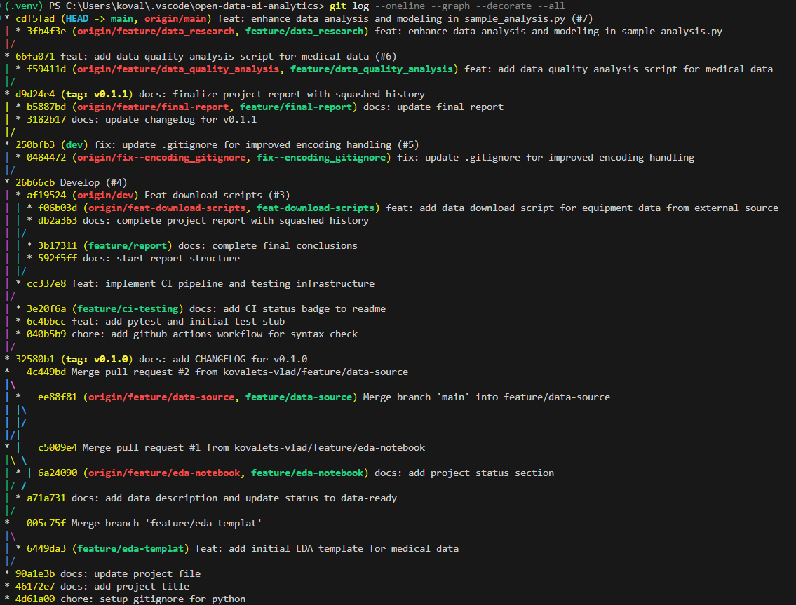

# Звіт про виконання індивідуального завдання

Підготував студент групи ші-32
Ковалець Владислав

## 1. Опис проєкту

Цей проєкт присвячений аналізу відкритих даних про стан та знос медичного обладнання. Метою роботи було не лише провести первинний аналіз (EDA), а й побудувати надійну інфраструктуру розробки з використанням сучасних практик Git.

## 2. Стратегія управління версіями

У проєкті впроваджено професійну модель розгалуження та стандарти ведення історії:

- **Гілки**: Використано стабільну гілку `main`, інтеграційну `dev` та тематичні гілки `feature/*`, `fix/*`, `docs/*`.
- **Conventional Commits**: Усі повідомлення комітів перекладено на англійську мову та приведено до стандарту (напр., `feat:`, `fix:`, `chore:`, `docs:`) для покращення читабельності.
- **Interactive Rebase**: Було проведено повну реорганізацію ранньої історії проєкту для виправлення повідомлень комітів та усунення конфліктів у файлі `README.md`.

## 3. Охайність історії та Squash

Однією з ключових вимог було впровадження **Squash Merge**:

- Для гілки `feature/ci-testing` було створено 3 окремі коміти, які описували етапи підготовки документації.
- Перед злиттям у гілку `dev` ці коміти було об'єднано в один змістовний запис.
- **Навіщо це потрібно?** Squash дозволяє уникнути захаращення основної історії дрібними технічними правками ("fix typo", "update header"), зберігаючи лише важливі етапи розробки функціоналу.

## 4. Безперервна інтеграція (CI) та тестування

Налаштовано автоматизований робочий процес через **GitHub Actions**:

- Створено workflow `.github/workflows/check.yml`, який при кожному пуші перевіряє синтаксичну коректність коду в папці `src/` за допомогою `compileall`.
- Додано тестову заглушку (stub) для `pytest` у папку `tests/` для демонстрації готовності до автоматизованого тестування.

## 5. Політика даних та вирішення технічних проблем

У проєкті реалізовано сувору політику щодо великих файлів:

- **Скрипт завантаження**: Створено `scripts/get_data.py` з механізмом повторних спроб (retries) для стабільного завантаження датасету у форматі CSV.
- **.gitignore**: Було вирішено критичну проблему з кодуванням файлу `.gitignore` (UTF-16), що заважало ігноруванню даних. Після перекодування в UTF-8 політика ігнорування працює коректно.

## 7. Аналіз даних та машинне навчання

На фінальному етапі було реалізовано повний цикл обробки даних (Data Science Pipeline):

- **Data Sanitization**: Розроблено механізм автоматичного очищення "брудних" даних. Використано регулярні вирази (Regex) для очищення фінансових показників від зайвих символів та виправлення форматів розділювачів (кома/крапка).
- **Перевірка гіпотез**:
    - Підтверджено кореляцію між віком обладнання та реальним відсотком зносу.
    - Виявлено найбільш капіталомісткі підгрупи медичних послуг через агрегацію `primaryAmountValue`.
- **Predictive Analytics**: Побудовано модель на базі алгоритму **Random Forest Regressor** для прогнозування балансової вартості активів. Модель враховує виробника, вік, підгрупу послуг та початкову ціну.

## 8. Релізи

Проєкт має чітке версіонування за допомогою тегів:

- **v0.1.0**: Базова структура проєкту та шаблон EDA.
- **v0.1.1**: Впровадження CI, скриптів завантаження та виправленої політики ігнорування даних.
- **v0.1.2**: Повний аналітичний модуль, виправлення критичних помилок типів даних та інтеграція ML-моделі.

Усі зміни задокументовано у файлі `CHANGELOG.md`.

## Посилання на репозиторій

🔗 [https://github.com/kovalets-vlad/open-data-ai-analytics]()

---

