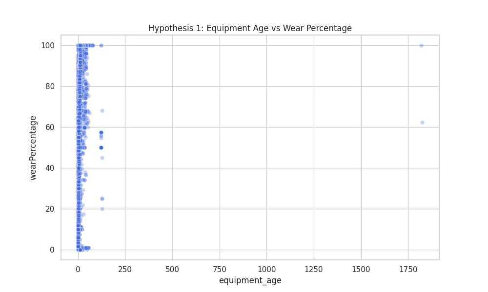
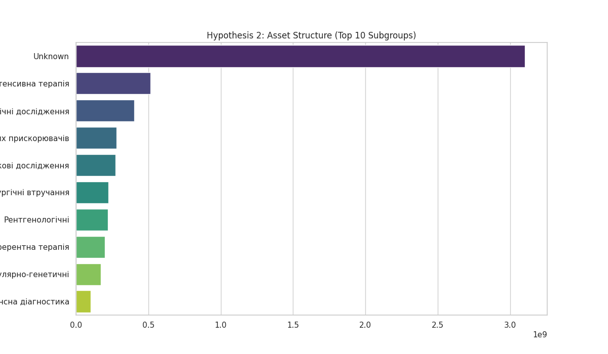
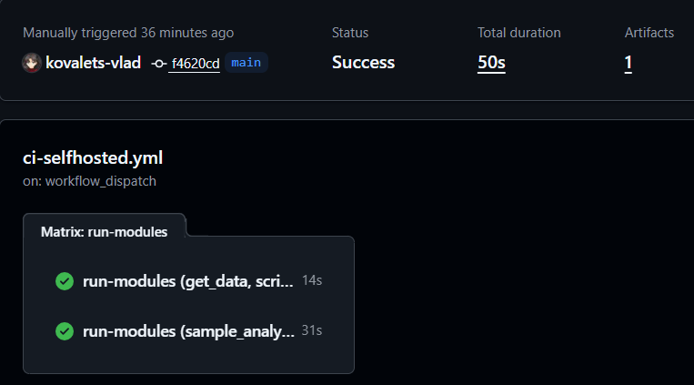
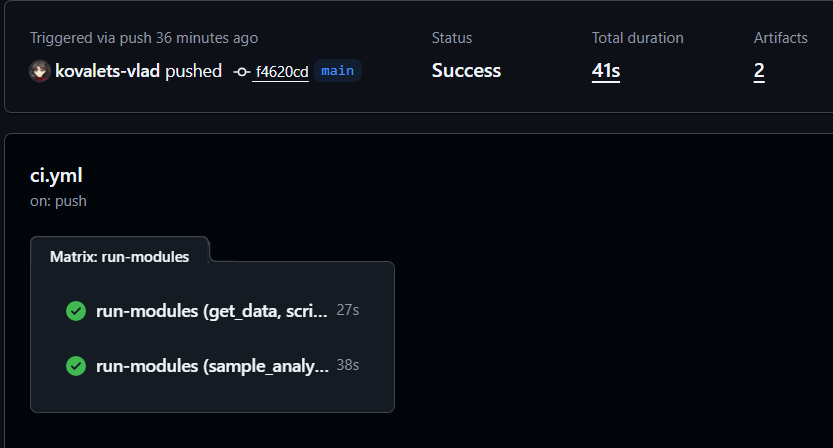

# Звіт про виконання індивідуального завдання

**Тема:** Автоматизація аналізу відкритих даних за допомогою CI/CD та машинного навчання

**Підготував:** студент групи ШІ-32
**Ковалець Владислав**

---

## 1. Опис проєкту

Цей проєкт присвячений аналізу відкритих даних про стан та знос медичного обладнання в Україні. Метою роботи було побудувати повний цикл розробки (End-to-End Pipeline): від автоматичного завантаження даних до розгортання моделі машинного навчання з використанням сучасних DevOps-практик.

## 2. Стратегія управління версіями

У проєкті впроваджено професійну модель розгалуження (Git Flow):

- **Conventional Commits:** повідомлення приведено до стандарту (`feat:`, `fix:`, `chore:`, `docs:`).
- **Interactive Rebase:** проведено реорганізацію історії для усунення конфліктів та "брудних" комітів.
- **Squash Merge:** для гілки `feature/ci-testing` використано Squash для об'єднання технічних комітів у один змістовний запис перед злиттям у `main`.

## 3. Безперервна інтеграція (CI) та інфраструктура

Налаштовано два типи робочих процесів (Workflows) через **GitHub Actions**:

### А. Хмарний конвеєр (GitHub-hosted)

Файл `.github/workflows/ci.yml` забезпечує автоматичну перевірку коду на серверах GitHub.

- **Матричне тестування (Matrix Strategy):** паралельний запуск модулів завантаження та аналізу.
- **Кешування:** впроваджено `pip cache`, що дозволило скоротити час встановлення залежностей з 3-4 хвилин до декількох секунд.

### Б. Локальний конвеєр (Self-hosted)

Файл `.github/workflows/ci-selfhosted.yml` налаштований для запуску на власному сервері (Windows).

- **Оптимізація під Windows:** вирішено проблему блокування файлів (`EBUSY`) через обмеження паралельності `max-parallel: 1`.
- **Робота з Unicode:** додано підтримку UTF-8 (`PYTHONIOENCODING`) для коректного відображення емодзі та кирилиці в логах термінала.

## 4. Порівняльний аналіз швидкості виконання

Було проведено порівняння ефективності хмарних та локальних обчислень:

| Етап                   | GitHub-hosted (Cloud) | Self-hosted (Local PC) | Примітки                               |
| :--------------------- | :-------------------- | :--------------------- | :------------------------------------- |
| **Завантаження даних** | ~27 сек               | **~14 сек**            | Локальний диск швидший за віртуальний. |
| **ML Аналіз**          | ~38 сек               | **~31 сек**            | Перевага локального CPU/RAM.           |
| **Загальний час**      | **~41 сек**           | ~50 сек                | Хмара виграє за рахунок паралелізму.   |

> **Висновок:** Хмарні сервери показують кращу загальну швидкість завдяки паралельному виконанню матриці завдань, тоді як локальний сервер швидший у виконанні конкретних важких обчислень.

## 5. Аналіз даних та Machine Learning

Реалізовано аналітичний модуль на базі **Random Forest Regressor**.

### Обробка даних (Sanitization)

- Використано регулярні вирази для очищення фінансових полів:
- Автоматичне заповнення пропусків у полі `wearPercentage` на основі балансової вартості.

### Метрики моделі

Для оцінки точності прогнозування вартості обладнання використано:

- **Коефіцієнт детермінації (R^2):** вимірює частку дисперсії, що пояснюється моделлю.
- **Mean Absolute Error (MAE):** середнє відхилення прогнозу в гривнях.

## 6. Вирішення технічних проблем (Case Studies)

1. **Помилка EBUSY (Windows):** Вирішена шляхом заміни стандартного `actions/checkout` на прямі команди `git fetch/reset` та обмеження черговості запусків.
2. **UnicodeEncodeError:** Виправлена через змінні середовища в YAML-конфігурації, що забезпечило стабільність логів на локальній машині.

## 7. Результати аналізу (Візуалізація)

Нижче наведено артефакти, згенеровані автоматично під час останнього запуску конвеєра:

Рис 1. Гіпотеза 1: Кореляція між віком обладнання та відсотком зносу.

Рис 2. Гіпотеза 2: Структура активів за підгрупами послуг.

## 8. Логи виконання моделі (run.log)

**Витяг із логів завантаження даних:**
Починаємо завантаження (режим стрімінгу)...
[OK] Дані успішно збережено: open-data-ai-analytics/data/raw/equipment_data.csv

**Витяг із логів успішного тренування моделі:**

Plaintext
--- Результати моделювання (Regression) ---
R2 Score: -0.4067
Mean Absolute Error: 52592.60 UAH

## 9. Actions

## 9. Релізи та артефакти

- **v0.1.3:** Повна інтеграція CI/CD та ML-моделі.
- **Artifacts:** Усі результати доступні для завантаження в розділі Actions кожного успішного запуску.

**Посилання на репозиторій:** [kovalets-vlad/open-data-ai-analytics](https://github.com/kovalets-vlad/open-data-ai-analytics)
