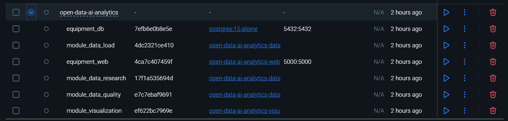
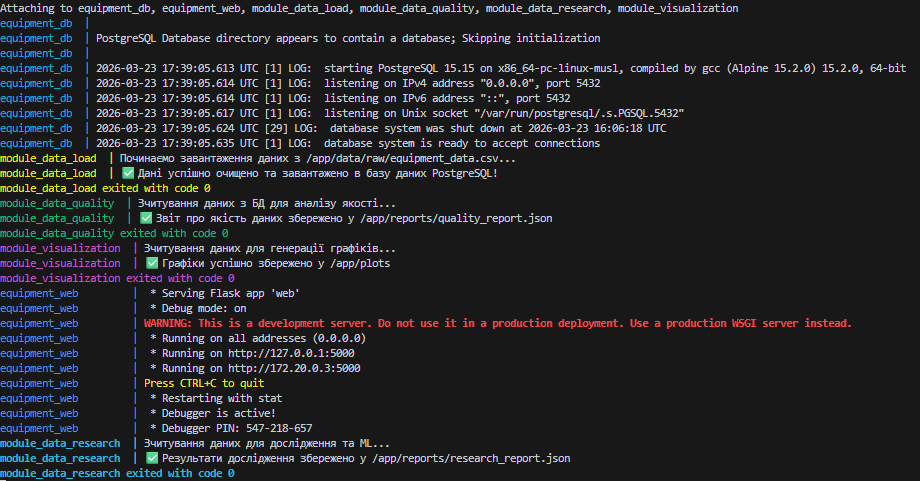
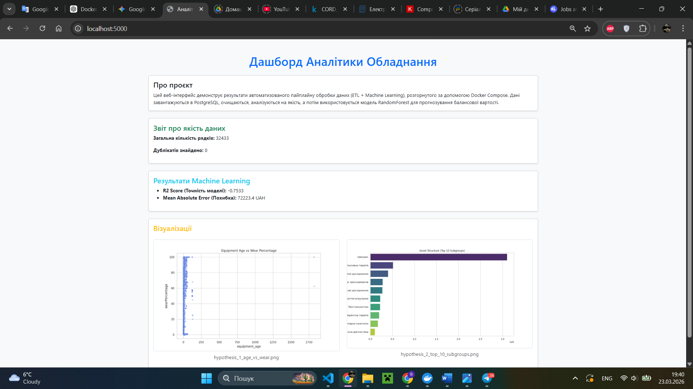

# Звіт про виконання індивідуального завдання (Лабораторна робота №2)

**Тема:** Автоматизація аналізу відкритих даних за допомогою Docker, мікросервісної архітектури та CI/CD

**Підготував:** студент групи ШІ-32 (AI-32)
**Ковалець Владислав**

---

## 1. Опис проєкту та архітектури

Цей проєкт присвячений аналізу відкритих даних про стан медичного обладнання в Україні. У межах другого етапу систему було трансформовано з набору скриптів у **мікросервісну платформу**, розгорнуту за допомогою **Docker Compose**. Кожен етап життєвого циклу даних ізольований у власному контейнері.

### Перелік створених сервісів:

- **`db` (PostgreSQL 15):** Центральна база даних для зберігання очищених даних.
- **`data_load`:** ETL-модуль, що відповідає за зчитування CSV, валідацію та імпорт у БД.
- **`data_quality_analysis`:** Виконує перевірку цілісності, пошук дублікатів та пропусків.
- **`data_research`:** Обчислює базові статистики та тренує модель **Random Forest** для прогнозування вартості.
- **`visualization`:** Генерує аналітичні графіки (PNG) на основі даних з PostgreSQL.
- **`web` (Flask):** Веб-інтерфейс, який збирає звіти (JSON) та графіки зі спільних томів і відображає їх у браузері.

---

## 2. Організація взаємодії та обміну даними

Взаємодія між компонентами організована наступним чином:

1.  **База даних (PostgreSQL):** Використовується для передачі структурованих даних між модулем завантаження та аналітичними сервісами через `SQLAlchemy`.
2.  **Docker Volumes:** Спільні іменовані томи (`reports_data`, `plots_data`) забезпечують передачу файлів (JSON-звітів та PNG-зображень) від модулів-обробників до веб-сервера.
3.  **Docker Network:** Усі сервіси працюють в одній ізольованій мережі, що дозволяє звертатися до БД за ім'ям сервісу `db` замість IP-адреси.
4.  **Healthchecks:** Налаштовано автоматичне очікування готовності бази даних перед стартом аналітичних модулів.

---

## 3. Скріншоти виконання роботи

### А. Список запущених контейнерів

> 
> _(На скріншоті має бути видно всі 6 запущених сервісів: db, web, та 4 модулі аналітики)._

### Б. Процес запуску (Docker Compose Up)

> 
> _(Видно логи завантаження даних та успішне завершення роботи аналітичних модулів)._

### В. Веб-інтерфейс у браузері

> 
> _(Видно дашборд із результатами ML-моделі та згенерованими графіками)._

---

## 4. Порівняльний аналіз швидкості (Cloud vs Self-hosted)

| Етап              | GitHub-hosted (Cloud) | Self-hosted (Local PC) | Примітки                             |
| :---------------- | :-------------------- | :--------------------- | :----------------------------------- |
| **Data Download** | ~27 sec               | **~14 sec**            | Локальний диск швидший за хмарний.   |
| **ML Analysis**   | ~38 sec               | **~31 sec**            | Перевага локального CPU (i5-11400H). |
| **Загальний час** | **~41 sec**           | ~50 sec                | Хмара виграє за рахунок паралелізму. |

---

## 5. Вирішення технічних складнощів (Case Studies)

1.  **Проблема Race Condition:** Скрипти намагалися підключитися до БД до її повної ініціалізації.
    - _Рішення:_ Використано `condition: service_healthy` у `compose.yaml` разом із `pg_isready` у блоці healthcheck.
2.  **Шляхи у Docker Volumes:** Файли не відображалися у веб-інтерфейсі через розбіжність шляхів монтування.
    - _Рішення:_ Уніфіковано робочі директорії (`/app/reports` та `/app/plots`) у всіх Dockerfile та Python-скриптах.
3.  **Екстракція артефактів у CI:** GitHub Actions не мав доступу до даних всередині зупинених контейнерів.
    - _Рішення:_ Реалізовано крок із `docker cp`, що динамічно знаходить ID контейнерів та копіює результати на хост-машину пайплайну.

---

## 6. Результати аналізу (Візуалізація)

Нижче наведено графіки, згенеровані модулем `visualization` всередині Docker-контейнера:

_Рис 1. Кореляція між віком обладнання та зносом._

_Рис 2. Аналіз структури активів за підгрупами._

---

## 7. Висновки

У ході роботи було успішно впроваджено мікросервісний підхід до аналізу даних. Використання Docker дозволило:

- Гарантувати відтворюваність аналізу на будь-якій машині.
- Автоматизувати розгортання через CI/CD пайплайн.
- Побудувати гнучку систему обміну даними між SQL-базою та файловими томами.

**Посилання на репозиторій:** [github.com/kovalets-vlad/open-data-ai-analytics](https://github.com/kovalets-vlad/open-data-ai-analytics)
