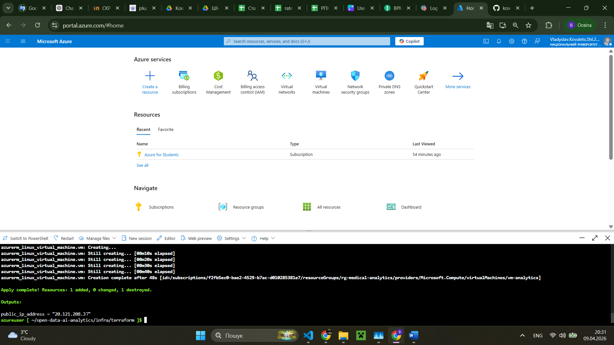
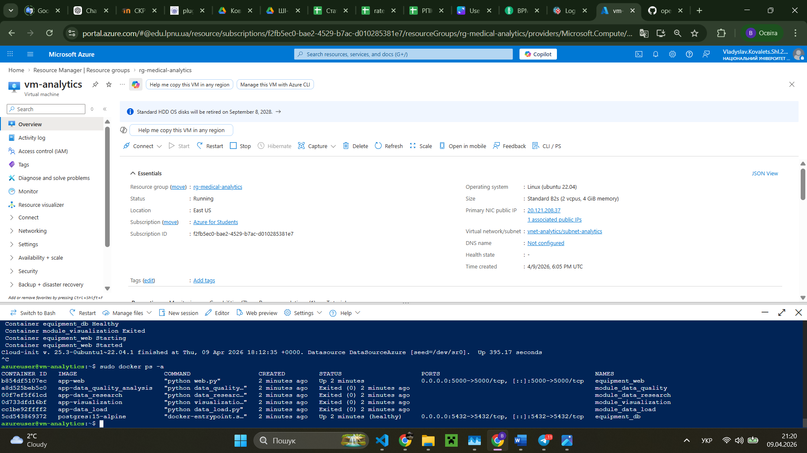
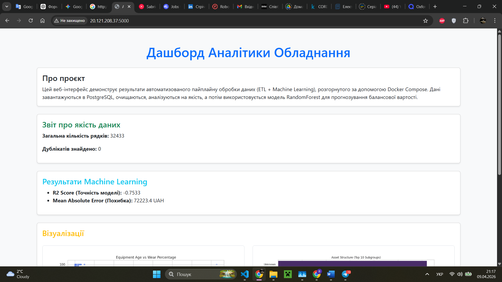

# Звіт про виконання індивідуального завдання (Лабораторна робота №4)

**Тема:** Повністю хмарне розгортання мікросервісної аналітичної платформи в Microsoft Azure за допомогою Terraform (Infrastructure as Code)

**Підготував:** студент групи Ші-32
**Ковалець Владислав**

---

## 1. Опис проєкту та архітектури

У межах цієї лабораторної роботи систему аналізу медичних даних було перенесено з локального середовища у хмару **Microsoft Azure**. Процес створення інфраструктури повністю автоматизовано за принципом **Infrastructure as Code (IaC)** за допомогою **Terraform**.

### Перелік створених хмарних ресурсів:

- **`azurerm_resource_group`:** Логічний контейнер для всіх ресурсів проєкту.
- **`azurerm_virtual_network` / `subnet`:** Ізольована віртуальна мережа для сервера.
- **`azurerm_public_ip`:** Динамічна публічна IP-адреса для доступу до веб-інтерфейсу з будь-якої точки світу.
- **`azurerm_network_security_group` (Файрвол):** Налаштовано правила (Inbound Rules) для відкриття порту `22` (SSH) та `5000` (Flask Web).
- **`azurerm_linux_virtual_machine`:** Сервер на базі Ubuntu 22.04 LTS (Standard_B2s), на якому розгортається Docker-проєкт.

---

## 2. Організація автоматизації (cloud-init)

Щоб уникнути ручного налаштування сервера після його створення, було використано технологію **cloud-init**, яка передається у віртуальну машину через параметр `custom_data` у Terraform.

**Сценарій cloud-init автоматично виконує такі кроки на першому старті:**

1. Оновлює системні пакети та встановлює залежності (`curl`, `git`, `python3-pip`).
2. Встановлює `Docker` та `Docker Compose plugin`, додає користувача в групу docker.
3. Клонує GitHub-репозиторій із проєктом.
4. **Динамічно генерує файл `.env`** з паролями до бази даних (щоб не зберігати секрети у відкритому репозиторії).
5. Завантажує первинний датасет (`equipment_data.csv`) через Python-скрипт.
6. Запускає контейнери командою `docker compose up -d --build`.

---

## 3. Скріншоти виконання роботи

### А. Створення інфраструктури (Terraform Apply)

> 

### Б. Підключення до сервера та перевірка контейнерів

> 

### В. Веб-інтерфейс у браузері через Public IP

> 

### Г. Віртуальна машина в Azure Portal

## 4. Порівняльний аналіз середовищ розгортання

| Характеристика                 | Локально                    | Хмара (Azure Standard_B2s + Terraform)       |
| :----------------------------- | :-------------------------- | :------------------------------------------- |
| **Доступність веб-інтерфейсу** | Тільки на `localhost`       | Доступно глобально через Public IP           |
| **Створення середовища**       | Ручний запуск Докера        | 100% автоматизовано (включаючи мережу)       |
| **Обчислювальна потужність**   | Залежить від пк             | 2 vCPU, 4 GB RAM (Повільніше, але достатньо) |
| **Масштабованість**            | Обмежена "залізом" ноутбука | Необмежена (можна змінити розмір VM у коді)  |

---

## 5. Вирішення технічних складнощів (Case Studies)

Під час розгортання в Azure виникло кілька специфічних проблем DevOps-рівня, які було успішно вирішено:

1. **Проблема невидимих символів (CRLF vs LF):**
    - _Симптом:_ Linux-сервер ігнорував файл `cloud-init.yaml`, Докер не встановлювався.
    - _Рішення:_ Файл був створений у Windows із закінченням рядків CRLF. Змінено кодування на LF у VS Code, після чого скрипт запрацював ідеально.

2. **Відсутність датасету перед стартом БД:**
    - _Симптом:_ Контейнер `visualization` падав із помилкою `relation "equipment_data" does not exist`.
    - _Рішення:_ Додано команди попереднього завантаження сирих даних (`pip install pandas`, `python scripts/get_data.py`) у `cloud-init` **до** запуску `docker compose`.

3. **Зависання сервера через оновлення ядра:**
    - _Симптом:_ Команда `package_upgrade: true` у cloud-init запускала глобальне оновлення Ubuntu, що блокувало встановлення Докера на 10+ хвилин.
    - _Рішення:_ Команду прибрано, залишено лише базове оновлення індексів `package_update: true` для пришвидшення деплою.

4. **Безпека секретних даних:**
    - _Симптом:_ Неможливість тримати `.env` з паролями від PostgreSQL на GitHub.
    - _Рішення:_ Реалізовано On-the-fly генерацію: скрипт автоматично виконує `echo "POSTGRES_PASSWORD=..." >> .env` прямо на сервері.

---

## 6. Висновки

У ході лабораторної роботи було освоєно сучасний підхід до управління інфраструктурою — **Infrastructure as Code**. Завдяки **Terraform** вдалося описати мережу, сервери та файрволи звичайним текстом, а використання **cloud-init** дозволило перетворити "голу" віртуальну машину на повністю налаштований продакшен-сервер без жодного ручного втручання по SSH.

Цей підхід робить розгортання проєкту передбачуваним, безпечним та легко відтворюваним, що є ключовим стандартом у сучасній DevOps-інженерії.

**Посилання на репозиторій:** [github.com/kovalets-vlad/open-data-ai-analytics](https://github.com/kovalets-vlad/open-data-ai-analytics) (папка `infra/terraform`)
