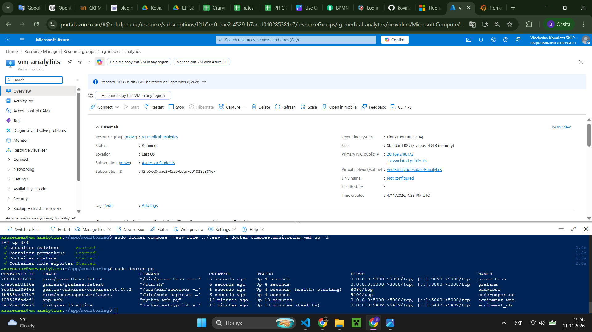
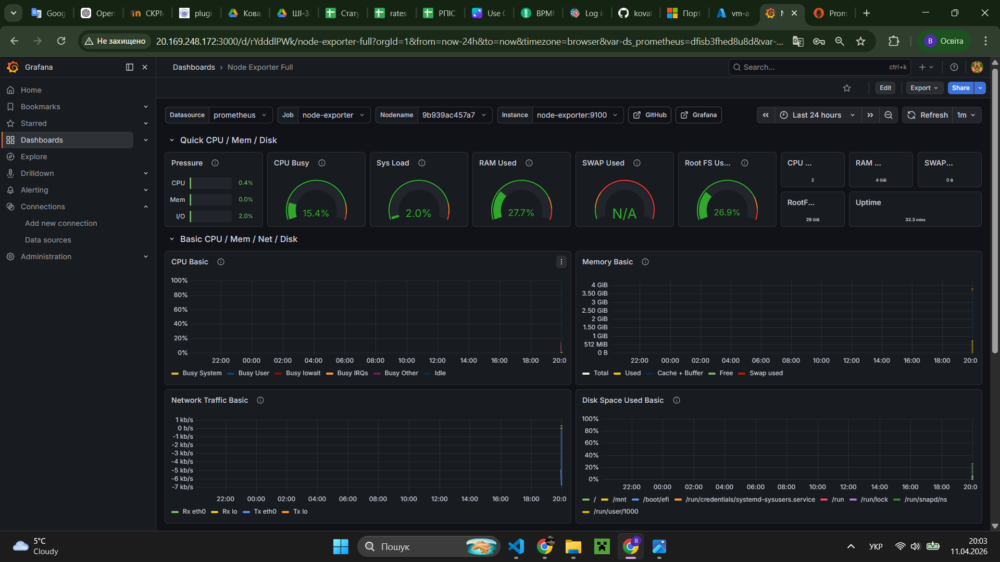

# Звіт про виконання індивідуального завдання (Лабораторна робота №5)

**Тема:** Моніторинг інфраструктури та веб-застосунків за допомогою Prometheus та Grafana
**Виконав:** студент групи АІ-32, Владислав Ковалець
**Навчальний заклад:** Національний університет "Львівська політехніка"

---

## 1. Мета роботи

Розгорнути систему збору метрик та візуалізації стану серверної інфраструктури для проєкту "Open Data AI Analytics". Налаштувати автоматичний моніторинг ресурсів (CPU, RAM, Disk) та інтегрувати систему моніторингу в Docker-середовище.

## 2. Інструментарій

- **Prometheus:** Система для збору та зберігання часових рядів (метрик).
- **Grafana:** Платформа для візуалізації даних та створення дашбордів.
- **Node Exporter:** Агент для експорту системних метрик Linux-сервера.
- **Docker & Docker Compose:** Інструменти контейнеризації для ізольованого запуску сервісів.

---

## 3. Опис конфігурації

Система моніторингу розгорнута в окремому стеку за допомогою Docker Compose.

### Конфігурація `docker-compose.monitoring.yml`

Було використано три основні сервіси:

1. `prometheus`: збирає дані з `node-exporter` кожні 15 секунд.
2. `grafana`: візуалізує дані на порту `3000`.
3. `node-exporter`: працює безпосередньо з хостовою системою через режим `network: host`.

```yaml
services:
    prometheus:
        image: prom/prometheus:latest
        container_name: prometheus
        volumes:
            - ./prometheus.yml:/etc/prometheus/prometheus.yml
        command:
            - "--config.file=/etc/prometheus/prometheus.yml"
        ports:
            - "9090:9090"

    grafana:
        image: grafana/grafana:latest
        container_name: grafana
        ports:
            - "3000:3000"
        environment:
            - GF_SECURITY_ADMIN_USER=admin
            - GF_SECURITY_ADMIN_PASSWORD=DevOps_Grafana_20!
        restart: unless-stopped
```

### Конфігурація prometheus.yml

Налаштовано scrape_configs для збору даних з самого сервера моніторингу:

```yaml
global:
    scrape_interval: 15s

scrape_configs:
    - job_name: "node_exporter"
      static_configs:
          - targets: ["node-exporter:9100"]
```

## 4. Хід роботи та візуалізація

### Крок 1. Запуск стеку моніторингу

Було виконано запуск контейнерів командою:
`docker compose -f docker-compose.monitoring.yml up -d`

> 

### Крок 2. Налаштування Data Source в Grafana

В інтерфейсі Grafana було додано джерело даних Prometheus за адресою `http://prometheus:9090`. Перевірка з'єднання пройшла успішно.

### Крок 3. Створення дашборду

Для візуалізації використано офіційний дашборд **Node Exporter Full (ID: 1860)**. Він дозволяє в реальному часі відстежувати:

- Завантаженість CPU (Load Average).
- Використання оперативної пам'яті (RAM Usage).
- Трафік мережевих інтерфейсів.
- Заповнення дискового простору.

---

## 5. Результати роботи

Нижче наведено фінальний вигляд дашборду моніторингу під час навантаження віртуальної машини роботою веб-застосунку.

> 

---

## 6. Висновки

В ході лабораторної роботи було успішно впроваджено систему моніторингу на базі Prometheus та Grafana.

1. Реалізовано централізований збір системних метрик.
2. Налаштовано зручну візуалізацію через Grafana.
3. Система дозволяє вчасно виявляти "вузькі місця" інфраструктури, що є критично важливим для Data Science проєктів з великим навантаженням на обчислювальні ресурси.

---

**Фінальна команда для очищення ресурсів:**

```bash
terraform destroy -auto-approve
```
