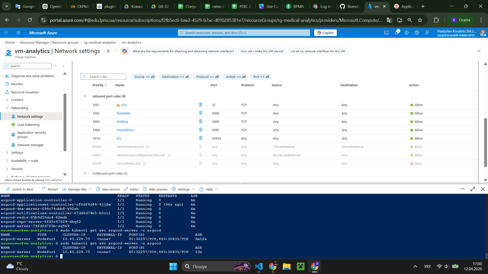
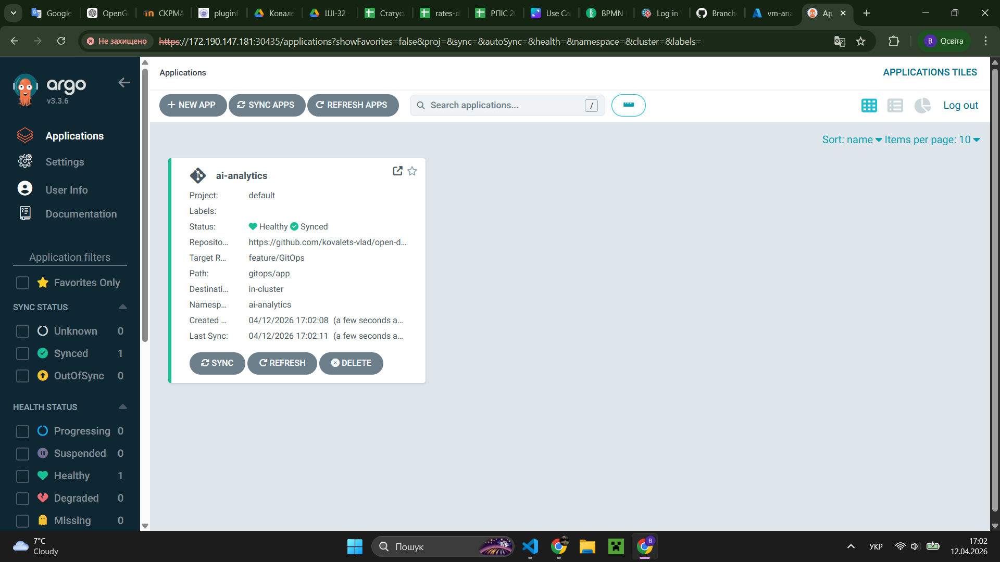
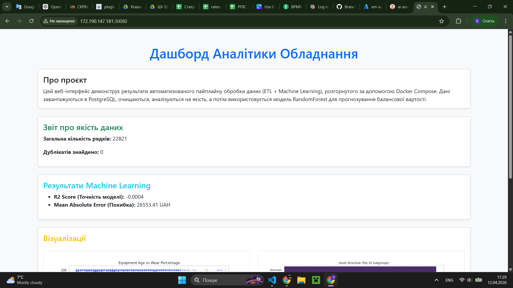
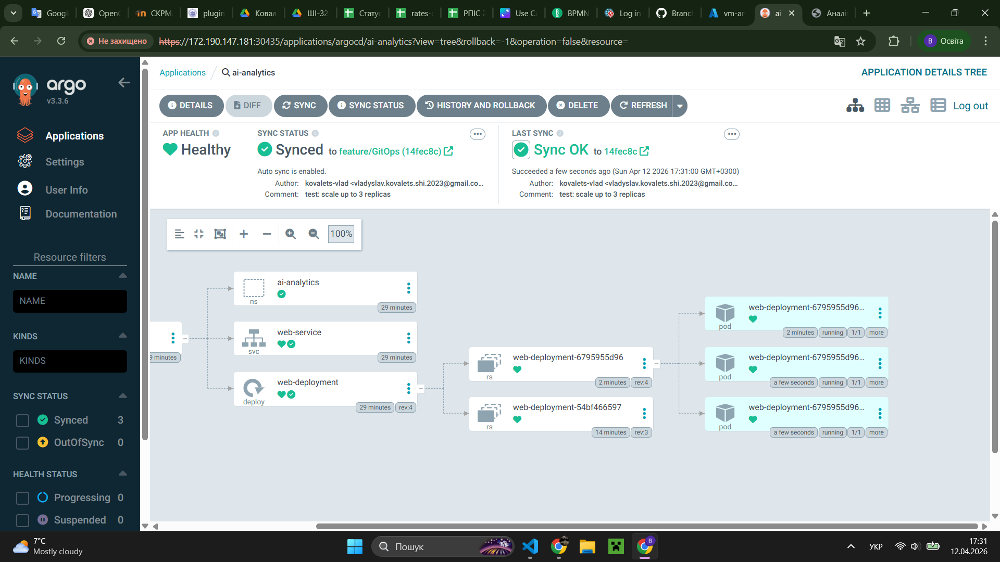
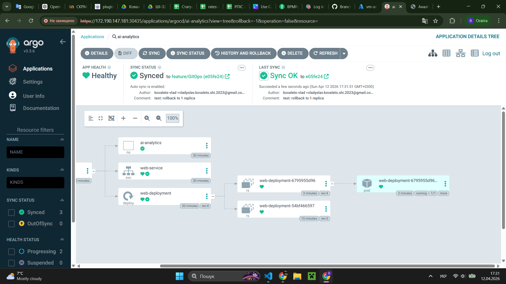
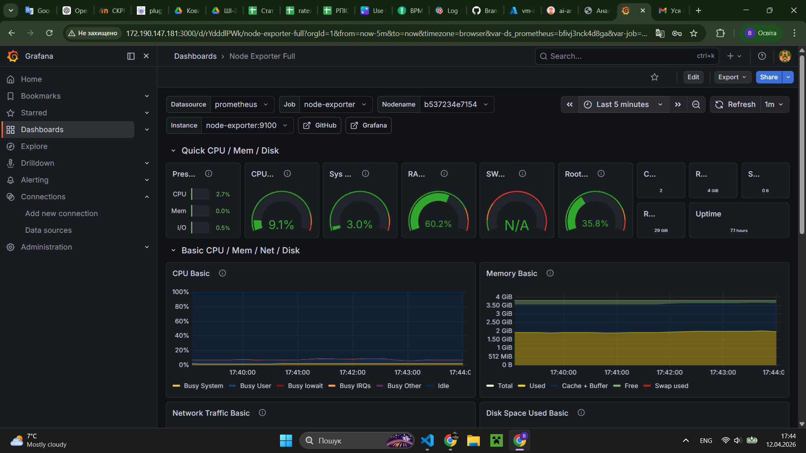

# Звіт про виконання індивідуального завдання (Лабораторна робота №6)

**Тема:** Розгортання та автоматизація Continuous Delivery за допомогою Kubernetes (k3s) та Argo CD (GitOps)
**Виконав:** студент групи АІ-32, Владислав Ковалець
**Навчальний заклад:** Національний університет "Львівська політехніка"

---

## 1. Мета роботи

Ознайомитися з принципами роботи оркестратора Kubernetes та методологією GitOps. Навчитися розгортати кластер k3s, налаштовувати Argo CD для автоматичного синхронізації стану інфраструктури з Git-репозиторієм та забезпечувати взаємодію між контейнеризованими сервісами в гібридному середовищі.

## 2. Інструментарій

- **k3s:** Легковаговий дистрибутив Kubernetes для edge-обчислень та розробки.
- **Argo CD:** Декларативний інструмент для реалізації GitOps в Kubernetes.
- **Terraform:** Інструмент IaC (Infrastructure as Code) для створення ресурсів в Azure.
- **Docker:** Контейнеризація для бази даних та допоміжних сервісів.
- **GitHub:** Хостинг репозиторіїв та джерело правди (Source of Truth) для GitOps.

---

## 3. Опис архітектури системи

Проєкт реалізовано за гібридною моделлю:

1. **База даних (PostgreSQL):** Запущена в стандартному Docker-контейнері через Docker Compose для забезпечення простого управління станом (State).
2. **Веб-застосунок (Flask):** Розгорнутий у Kubernetes-кластері (k3s) у вигляді `Deployment` та `Service`.
3. **Argo CD:** Виступає контролером, який стежить за гілкою `feature/GitOps` у GitHub. При зміні YAML-маніфестів у папці `gitops/app`, Argo CD автоматично оновлює стан об'єктів у кластері.

Для доступу до веб-застосунку налаштовано `NodePort` на порту **30080**, а для доступу до панелі Argo CD — порт **30435**.

---

## 4. Хід роботи та візуалізація

### Крок 1. Підготовка інфраструктури (IaC)

Розгортання віртуальної машини в Azure було автоматизовано за допомогою Terraform та `cloud-init`. Під час ініціалізації було встановлено:

- Docker Engine для контейнеризації бази даних.
- Lightweight Kubernetes (k3s) для оркестрації веб-застосунку.
- Argo CD для реалізації GitOps-підходу.

**Перевірка стану кластера:**
`sudo kubectl get nodes` — вузол у статусі `Ready`.
`sudo kubectl get pods -n argocd` — усі компоненти Argo CD запущені.

> 

### Крок 2. Налаштування GitOps через Argo CD

Було створено Application в Argo CD, який відстежує репозиторій `https://github.com/kovalets-vlad/open-data-ai-analytics.git` (гілка `feature/GitOps`).

- **Path:** `gitops/app`
- **Sync Policy:** Automated (Self-heal, Prune).

> 

### Крок 3. Налаштування гібридної мережевої взаємодії

Оскільки база даних (PostgreSQL) працює в Docker, а веб-застосунок (Flask) у Kubernetes, було налаштовано зв'язок через внутрішній IP хоста та прокинуто порти:

- **Service:** NodePort 30080.
- **Volume:** Використано `hostPath` для монтування згенерованих звітів та графіків з томів Docker (`app_plots_data`) безпосередньо в K8s-под.

### Крок 4. Демонстрація автоматичного оновлення та Rollback

Для перевірки GitOps-циклу було внесено зміни в `deployment.yaml` (зміна кількості реплік):
Після `git push` Argo CD автоматично виявив розбіжність (Out of Sync) та привів стан кластера до описаного в Git. Після цього було виконано відкат (Rollback) до початкового стану.

---

## 5. Результати роботи

У ході виконання роботи було досягнуто повної інтеграції між контейнеризованим середовищем Docker та оркестратором Kubernetes. Нижче наведено детальний опис отриманих результатів.

> 

### 5.1. Функціонування веб-застосунку

Веб-застосунок, розгорнутий у Kubernetes, доступний за зовнішньою адресою віртуальної машини через порт `30080`. Завдяки налаштованим змінним середовища в `deployment.yaml`, Flask-додаток успішно підключається до бази даних PostgreSQL, що працює в Docker-контейнері на хості.

На інтерфейсі відображаються графіки аналітики (plots) та звіти (reports), які фізично зберігаються в Docker-томах і монтуються в Kubernetes-под за допомогою `hostPath`. Це демонструє ефективну роботу з "державними" (stateful) даними в ефемерному середовищі K8s.

> 

### 5.2. Перевірка GitOps-циклу та масштабування

Під час тестування було продемонстровано автоматичне реагування системи на зміну конфігурації в Git. Після оновлення параметра `replicas: 3` у репозиторії, Argo CD миттєво ініціював створення додаткових подів. Аналогічно було перевірено функцію `Rollback`, яка дозволяє повернути систему до попереднього стабільного стану (1 репліка) шляхом скасування коміту або використання вбудованих засобів Argo CD.

> 

### 5.3. Моніторинг та Grafana

Незважаючи на міграцію основної частини застосунку в Kubernetes, стек моніторингу в Docker продовжує збирати метрики. Дашборд Grafana відображає навантаження на ресурси віртуальної машини в реальному часі, що дозволяє контролювати стан вузла кластера (K8s Node) та бази даних одночасно.

> 

---

## 6. Висновки

В ході роботи було реалізовано сучасний підхід до розгортання ПЗ — GitOps.

1. **Автоматизація:** Будь-які зміни в інфраструктурі тепер відбуваються через Git-коміти, що виключає людський фактор при ручному налаштуванні сервера.
2. **Оркестрація:** Використання k3s дозволило гнучко керувати веб-застосунком, забезпечуючи його самовідновлення.
3. **Гібридна архітектура:** Доведено можливість успішної інтеграції "традиційних" Docker-контейнерів з Kubernetes-кластером в межах однієї віртуальної машини.
